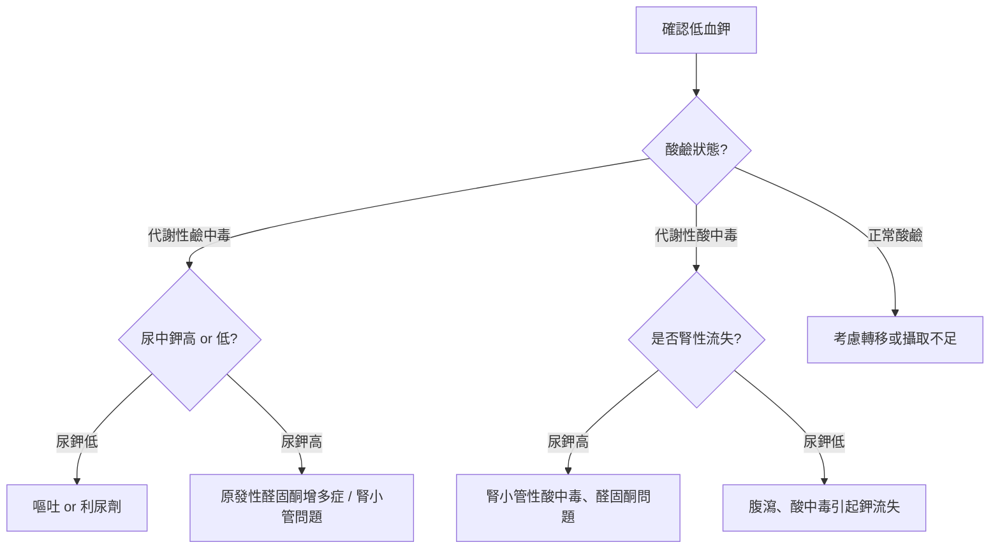

# 🧂 低血鉀（Hypokalemia）鑑別診斷流程

---

## 🧠 一、鉀離子的生理意義

鉀（K⁺）是**細胞內最主要的正離子**，負責維持：   
- 💓 心臟電活動（讓心臟規律跳動）  
- 💪 肌肉收縮  
- ⚡ 神經訊號傳導  

> 正常血鉀濃度：**3.5～5.0 mmol/L**  
> 當 < 3.5 mmol/L 時，即為「低血鉀」。

---

## ⚠️ 二、低血鉀的三大原因（記法：進少、出多、分錯房間）

| 類別 | 原理 | 常見情況 |
|------|------|----------|
| 1️⃣ 攝取不足 | 吃太少含鉀食物 | 飢餓、厭食症、長期輸液未補鉀 |
| 2️⃣ 流失過多 | 鉀從體內被排掉 | 嘔吐、腹瀉、利尿劑、腎臟病 |
| 3️⃣ 鉀轉移到細胞內 | 鉀被「搬家」到細胞內 | 胰島素分泌↑、鹼中毒、β₂刺激（氣喘用藥） |

??? info "學習重點"
    - 低血鉀不是只有「鉀降低」，要分清楚：**是真的流失**還是**只是轉移**。  
    - 最關鍵的步驟是：「酸鹼狀態」+「尿中鉀排出量」。  
    - 記法：「進少、出多、分錯房間」。

---

## 三、流程圖

## 🧪 四、要做哪些檢查（低血鉀的評估步驟）

!!! tip "目的"
    檢查的重點不是單看血鉀數字，  
    而是要**找出低血鉀的真正原因**：  
    是「流失」還是「轉移」，是「腎臟」還是「腸胃」造成的。

---

### 🩸 1️⃣ 血液檢查（基本起點）

| 檢查項目 | 用途 | 解釋 |
|------------|--------|--------|
| **血鉀（K⁺）** | 確認低鉀程度 | <3.0 mmol/L 需注意心律風險 |
| **血鈉（Na⁺）** | 觀察電解質比例 | 高鈉常見於醛固酮過多 |
| **血氯（Cl⁻）** | 協助判斷酸鹼狀態 | 嘔吐會造成低氯、鹼中毒 |
| **血液酸鹼（ABG）** | 判斷代謝性酸或鹼中毒 | 幫助分群：嘔吐 vs 腎小管酸中毒 |
| **腎功能（BUN, Cr）** | 評估腎是否能正常排鉀 | 腎衰竭者鉀排出受限 |
| **血糖、胰島素** | 檢查轉移性低鉀 | 胰島素↑會使鉀進入細胞 |

---

### 💧 2️⃣ 尿液檢查（判斷腎臟是否在「浪費鉀」）

| 檢查項目 | 用途 | 解釋 |
|------------|--------|--------|
| **尿鉀（U-K⁺）** | 判斷鉀流失位置 | <20 mmol/L → 腎在留鉀；>20 mmol/L → 腎在漏鉀 |
| **尿氯（U-Cl⁻）** | 幫助區分原因 | 嘔吐時尿氯低；利尿劑或腎性流失時尿氯高 |
| **尿鈉（U-Na⁺）** | 佐證利尿劑或腎小管功能 | 高尿鈉→腎性流失；低尿鈉→體液流失 |
| **尿滲透壓（U-Osm）** | 評估腎濃縮功能 | 可協助排除腎小管疾病 |

> 🧩 若條件允許，可同時測「**尿鉀/肌酐比（K/Cr ratio）**」：
> - <13 mmol/g → 腎外流失  
> - >13 mmol/g → 腎性流失

---

### 🧬 3️⃣ 荷爾蒙與特殊檢查（懷疑腎性流失時）

| 檢查項目 | 用途 | 解釋 |
|------------|--------|--------|
| **血漿腎素活性（PRA）** | 評估腎素系統 | 高腎素 + 高醛固酮 → 繼發性醛固酮症 |
| **醛固酮（Aldosterone）** | 檢查是否過多 | 高醛固酮 + 高血壓 + 低鉀 → 原發性醛固酮症 |
| **皮質醇（Cortisol）** | 排除庫欣症 | 高皮質醇可模仿醛固酮作用 |
| **尿利尿劑篩檢** | 排除藥物造成流失 | 偵測 furosemide、thiazide 類利尿劑 |

---

### 🧫 4️⃣ 進階或輔助檢查（根據臨床懷疑）

| 檢查項目 | 用途 | 解釋 |
|------------|--------|--------|
| **心電圖（ECG）** | 評估心律變化 | 低鉀：T 波變平、U 波出現、QT 延長 |
| **腎臟超音波** | 觀察結構 | 排除腎病變或腫瘤 |
| **遺傳性檢測** | 年輕患者且家族病史 | Bartter、Gitelman 症候群等 |

---

!!! summary "小結"
    低血鉀的檢查邏輯可歸納為：
    1. **血液酸鹼** → 區分代謝型態  
    2. **尿鉀排出量** → 判斷是否腎性流失  
    3. **荷爾蒙水平** → 排查醛固酮或腎素異常  
    4. **特殊檢查** → ECG + 腎臟影像 + 遺傳分析  
     🧠 最終目標是釐清：「鉀流失在哪裡、為什麼會流失」。

## 🩺 第五點：低血鉀的治療原則

### 1️⃣ 確認與評估  
- **再次確認檢驗值**：排除檢驗錯誤（例如溶血、標本放太久等）。  
- **評估症狀嚴重度**：  
  - 輕度（K⁺ 3.0–3.5 mmol/L）：通常無症狀  
  - 中度（K⁺ 2.5–3.0 mmol/L）：可能有肌肉無力  
  - 重度（K⁺ <2.5 mmol/L）：可能出現呼吸肌麻痺、心律不整（尤其在使用強心苷者）

---

### 2️⃣ 治療重點：補鉀與處理病因
#### (1) 找出並治療原因
- **停止導致低鉀的藥物**：如利尿劑、甘草、胰島素過量等。  
- **控制原發疾病**：如腎小管性酸中毒、嘔吐、腹瀉、原發性醛固酮症等。

#### (2) 鉀補充
- **口服補鉀**（首選方式）：
  - 適用於無嚴重症狀者。
  - 常用製劑：氯化鉀（KCl）。
  - 每次給藥後需監測血鉀與酸鹼狀態。  

- **靜脈補鉀**（僅限重度或無法口服者）：
  - 速率不超過 **10–20 mmol/hr**（需監測心電圖）。  
  - 若需快速補充，應以**中心靜脈路徑**給藥以避免局部刺激。  
  - 切勿與葡萄糖溶液併用（會使胰島素上升、鉀更低）。

---

### 3️⃣ 同步矯正其他電解質異常
- **低鎂血症** 常與低鉀併發：鎂離子會影響腎臟保鉀能力。  
  - 若鎂偏低，需先或同步補鎂，否則補鉀效果不佳。  

---

### 4️⃣ 監測與預防
- **監測血鉀變化**：補鉀後 2–4 小時重新抽血檢查。  
- **長期預防**：
  - 避免過度使用利尿劑。  
  - 若必須使用，可加用保鉀利尿劑（如 spironolactone、amiloride）。  
  - 飲食中增加富含鉀的食物（如香蕉、柳橙汁、馬鈴薯等）。  

---

### 💡 重點整理
- 輕度 → 口服補鉀即可  
- 中重度或症狀明顯 → 靜脈補鉀（需監測）  
- 補鉀前後都要：**找原因 + 看鎂離子 + 監測 ECG**

