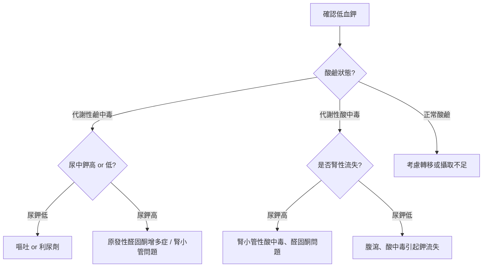

# 🧂 低血鉀（Hypokalemia）鑑別診斷流程

---

## 🧠 一、鉀離子的生理意義

鉀（K⁺）是**細胞內最主要的正離子**，負責維持：   
- 💓 心臟電活動（讓心臟規律跳動）  
- 💪 肌肉收縮  
- ⚡ 神經訊號傳導  

> 正常血鉀濃度：**3.5～5.0 mmol/L**  
> 當 < 3.5 mmol/L 時，即為「低血鉀」。

---

## ⚠️ 二、低血鉀的三大原因（記法：進少、出多、分錯房間）

| 類別 | 原理 | 常見情況 |
|------|------|----------|
| 1️⃣ 攝取不足 | 吃太少含鉀食物 | 飢餓、厭食症、長期輸液未補鉀 |
| 2️⃣ 流失過多 | 鉀從體內被排掉 | 嘔吐、腹瀉、利尿劑、腎臟病 |
| 3️⃣ 鉀轉移到細胞內 | 鉀被「搬家」到細胞內 | 胰島素分泌↑、鹼中毒、β₂刺激（氣喘用藥） |

---

## 三、流程圖
